# GraphQL Documentation Generation Flow

## Visual Flow Diagram

```mermaid
graph TD
    A["👨‍💻 Developer modifies schema.graphql<br/>in GraphQl-players repo"] --> B["📤 Push to main/documentGeneration branch"]
    B --> C["⚡ GitHub Actions triggers<br/>trigger-docs-update.yml"]
    C --> D{"🔐 Check DOCS_REPO_TOKEN<br/>secret exists?"}
    D -->|"❌ No"| E["💥 Workflow fails<br/>Missing secret"]
    D -->|"✅ Yes"| F["📡 Send repository dispatch<br/>to graphql-api-docs repo"]
    F --> G["⚡ GitHub Actions triggers<br/>generate-docs-site.yml"]
    G --> H{"🔐 Check MAIN_REPO_TOKEN<br/>secret exists?"}
    H -->|"❌ No"| I["💥 Workflow fails<br/>Missing secret"]
    H -->|"✅ Yes"| J["📥 Download schema.graphql<br/>from GraphQl-players repo"]
    J --> K["🔍 Compare with existing<br/>documentation"]
    K --> L{"📊 Schema changed?"}
    L -->|"❌ No"| M["✅ Skip update<br/>Documentation up to date"]
    L -->|"✅ Yes"| N["📝 Generate new documentation<br/>using graphql-markdown"]
    N --> O["📁 Update docs/graphql/<br/>schema-documentation.md"]
    O --> P["🚀 Deploy to GitHub Pages<br/>gh-pages branch"]
    P --> Q["🌐 Documentation live at<br/>lathaaj.github.io/graphql-api-docs"]
    
    style A fill:#e1f5fe,stroke:#01579b,stroke-width:2px
    style Q fill:#e8f5e8,stroke:#2e7d32,stroke-width:2px
    style E fill:#ffebee,stroke:#c62828,stroke-width:2px
    style I fill:#ffebee,stroke:#c62828,stroke-width:2px
    style M fill:#fff3e0,stroke:#ef6c00,stroke-width:2px
    style P fill:#f3e5f5,stroke:#7b1fa2,stroke-width:2px
```

## Interactive Flow Diagram

To view this diagram interactively, you can:

1. **Copy the Mermaid code** above
2. **Visit [Mermaid Live Editor](https://mermaid.live/)** 
3. **Paste the code** in the editor
4. **View the rendered diagram**

Or use any of these tools:
- **GitHub**: Renders Mermaid diagrams in markdown files
- **VS Code**: Install Mermaid extension
- **Online**: [Mermaid Live Editor](https://mermaid.live/)

## Flow Description

### 1. **Schema Modification** (GraphQl-players repo)
- Developer modifies `src/main/resources/graphql/schema.graphql`
- Changes are committed and pushed to `main` or `documentGeneration` branch

### 2. **Trigger Workflow** (GraphQl-players repo)
- GitHub Actions detects changes to schema file
- `trigger-docs-update.yml` workflow runs
- Validates `DOCS_REPO_TOKEN` secret
- Sends repository dispatch event to `graphql-api-docs` repo

### 3. **Documentation Generation** (graphql-api-docs repo)
- `generate-docs-site.yml` workflow receives dispatch event
- Validates `MAIN_REPO_TOKEN` secret
- Downloads latest schema from GraphQl-players repo
- Compares with existing documentation

### 4. **Conditional Update**
- If no changes detected: Skip update, log status
- If changes detected: Generate new documentation using `graphql-markdown`

### 5. **Deployment**
- Updates documentation files
- Deploys to GitHub Pages (`gh-pages` branch)
- Documentation becomes live at the GitHub Pages URL

## Key Components

- **Repository Dispatch**: Communication between repositories
- **Secrets Management**: `DOCS_REPO_TOKEN` and `MAIN_REPO_TOKEN`
- **Change Detection**: Avoids unnecessary updates
- **GitHub Pages**: Automatic deployment and hosting
